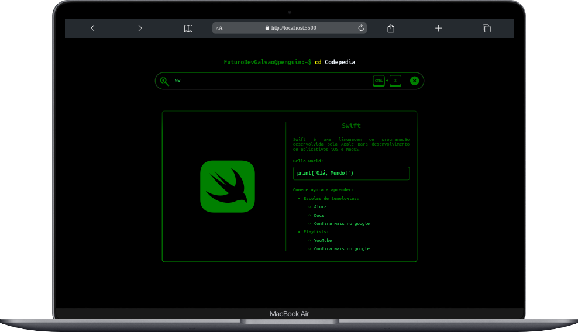
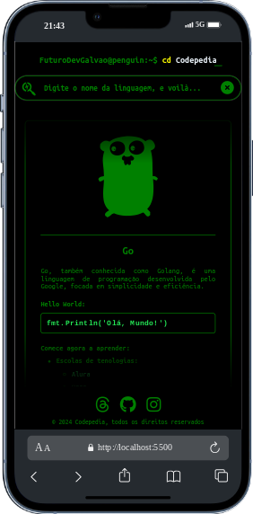
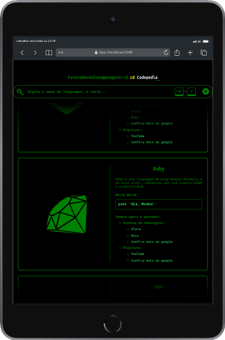

# Codepedia

## Descrição

O Codepedia fornece uma visão superficial sobre determinadas linguagens de programação, mas também fontes de aprofundamento sobre essas tecnologias. Seu estilo foi inspirado em terminais linux.

## Screenshots







## Sobre o Projeto

Este projeto foi desenvolvido durante a **Imersão Dev com Google Gemini da Alura**.

## Tecnologias Utilizadas

- HTML
- CSS
- JS

## Pré-requisitos para baixar o projeto

- Possuir o git instalado e configurado

## Instalação

```bash
  git clone https://github.com/FuturoDevGalvao/Imersao-Dev-com-Google-Gemini.git
```

Entre no diretório do projeto

```bash
  cd Imersao-Dev-com-Google-Gemini
```

Por fim, abra o projeto em um editor de código

```bash
  code .
```
